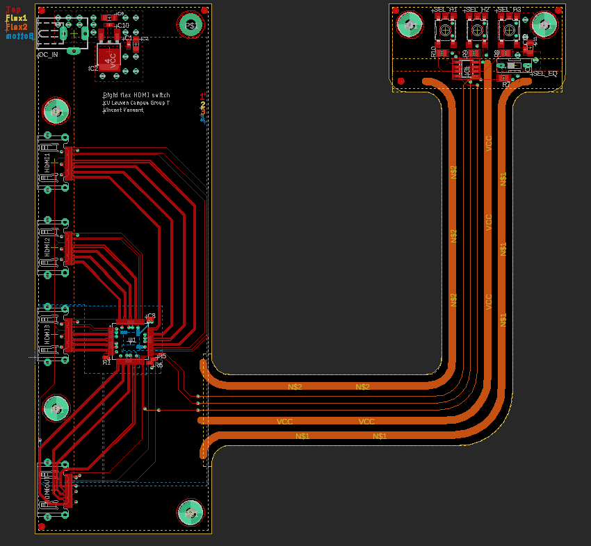

# Rigid Flex HDMI Switch PCB - Eagle Design

## Introduction
This document provides an overview of a Rigid Flex HDMI Switch PCB designed using Eagle..

## Design rules
- According to the design guide from Wurth Electronics, extra mechanical layers are utilized to 
denote the flexible and rigid sections of the PCB. The flexible portion of the PCB is outlined 
on Layer 113 (flex), while Layer 114 (rigid) is used to delineate the rigid section.
- The differential pairs in the design are routed with a spacing of 150 micrometers (um) and a 
trace width of 260um. This configuration ensures that the differential pairs maintain their 
characteristic impedance, which is crucial for signal integrity. Additionally, careful attention 
has been paid to maximize the distance between different differential pairs. This strategy is 
employed to minimize crosstalk.
- In this PCB design, Flex1 is the ground layer, providing a return path for current. Flex2 is the 
VCC layer, distributing power to the components. The top layer primarily carries signal traces, 
while the bottom layer is used for both signal routing and distributing a +5V power supply.
-  According to the design guide from Wurth Electronics, two additional (unconnected) tracks 
are incorporated on the outer edges of the PCB. This design feature is intended to enhance 
the rigidity of the flex section and decrease the likelihood of tearing, thereby improving the 
durability and longevity of the PCB.
- To ensure efficient power distribution and adequate heat dissipation for power components 
on the top layer, the design includes multiple vias and planes (top layer). These features 
enhance connectivity and allow heat to spread out efficiently.
- The decoupling capacitors for the TDMS351 are strategically positioned on the bottom layer, 
directly beneath the IC. This placement is chosen to ensure effective decoupling, providing a 
short path for current transients and reducing noise. This arrangement is also due to space 
constraints on the top layer, making the bottom layer a practical choice for accommodating 
these components.

## Layer Configuration
- **Top Layer:** Primarily for signal traces.
- **Flex1:** Ground layer for current return path.
- **Flex2:** VCC layer for power distribution.
- **Bottom Layer:** Used for signal routing and a +5V power supply.

## PCB Preview
- **Routing View**
  
- **Top View**  
  
- **Bottom View**  
  

## Conclusion
This README provides a basic guide to a Rigid Flex HDMI Switch PCB. For detailed design files and further information, refer to the included Eagle project files.
